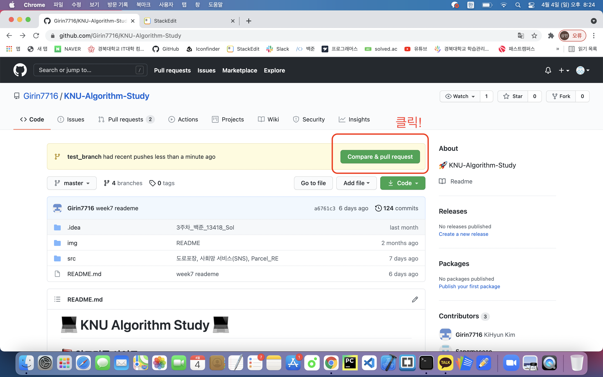
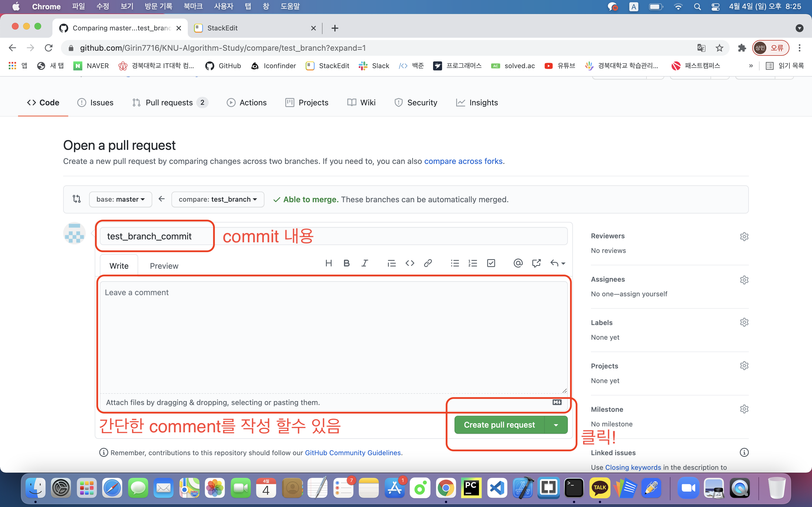
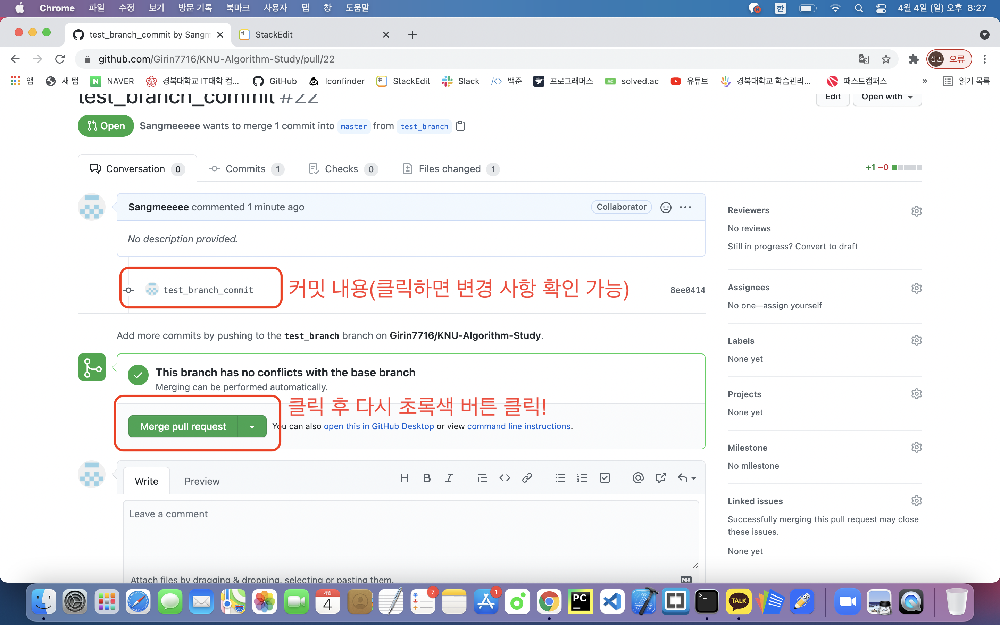
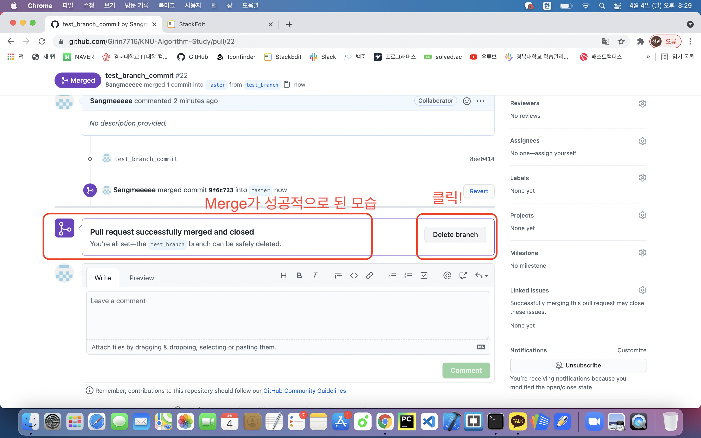
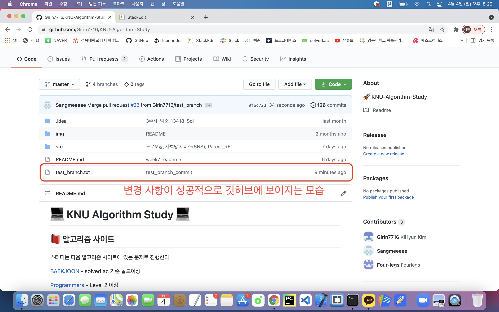

# :computer: KNU Algorithm Study :computer:

## :closed_book: 알고리즘 사이트

스터디는 다음 알고리즘 사이트에 있는 문제로 진행한다.

[BAEKJOON](https://www.acmicpc.net/) - solved.ac 기준 골드이상

[Programmers](https://programmers.co.kr/learn/challenges?tab=all_challenges) - Level 2 이상

## :orange_book: 진행방식

- **매주 2~3문제**를 정해서 문제풀이를 진행.
- 주마다 돌아가면서 문제 선택
- 푼 문제에 대해서는 해당 **코드**와 함께 **코드 풀이**인 `README.md`를 작성하여 업로드
- 자신이 사용하고 싶은 언어로 풀이(C++,Java,Python...)
- **최대 2시간동안** 고민해서 풀지 못하면 구글에서 답을 찾아보고 로직을 이해한 뒤 **코드 작성 + 코드 풀이 업로드**
  - 이 경우 나중에 다시 풀기 위해 `Week Study`에 자신의 이름을 업로드할 때 [이름_Re](파일경로) 로 수정한다.
  - 추후, 다시 풀게 되면 [이름](파일경로)로 바꾸기.
- Github 활용
  - Repository를 Fork해온다.
  - 문제를 풀고 **문제 단위**로 commit을 한다.
    - ex> git commit -m "2주차_백준_11054_Sol"
    - ex> git commit -m "2주차_백준_11054_Re"
  - `src/개인 폴더/문제사이트_문제 제목/`에 `코드`와 `README.md `를 업로드한다.
  - 각자의 브랜치를 생성하고, 각자의 브랜치로 PR을 보낸다.

### 브랜치 작성, commit, 삭제 방법

본 이미지와 예시는 Mac OS에서 작성되었지만 git command를 사용하기때문에 Window에서는 git bash **(git clone 폴더 (해당 스터디에서는 KNU-Algorithm-study폴더가 되겠다)에서 우클릭 후, git bash 클릭)** 를 사용했다 생각하고 작성한다.

기본적으로 깃허브의 사용법 숙달을 위해 **각자 인원은 본인의 브랜치를 만들고**, 그 브랜치 안에서 알고리즘 문제를 풀고, 각자의 브랜치를 master 브랜치에 붙이는 것으로 코드의 제출을 마무리한다.

아래 command들을 통해 branch의 생성과 pull request 요청을 할 수 있다.

현재 branch 확인 command를 제외하고 아래의 단계를 실행하면 완료 할수 있다.

#### 현재 branch 확인 command

- git branch

		isangmin@isangmin-ui-MacBookPro KNU-Algorithm-Study % git branch

#### branch 생성 command

- git branch '원하는 branch 이름'

		isangmin@isangmin-ui-MacBookPro KNU-Algorithm-Study % git branch test_branch

#### branch 이동 command

- git checkout '원하는 branch 이름'

		isangmin@isangmin-ui-MacBookPro KNU-Algorithm-Study % git checkout test_branch

#### (이동한 branch에서) git add command

##### ※ add 하기 전, 본인이 깃허브에 올릴 파일을 브랜치 안에 넣어줘야 한다. (미리 KNU-Algorithm-Study 폴더에 branch_text.txt파일을 만들어 놓았다. 원래대로라면 본인이 작성한 코드를 본인의 폴더안에 넣어놓은 상태면 된다.)

- git add *

		isangmin@isangmin-ui-MacBookPro KNU-Algorithm-Study % git add *

#### (이동한 branch에서) git commit command

- git commit -m '원하는 커밋 내용'

		isangmin@isangmin-ui-MacBookPro KNU-Algorithm-Study % git commit -m "test_branch_commit"

#### (이동한 branch에서) git push command

- git push origin '현재 브랜치 이름'

		isangmin@isangmin-ui-MacBookPro KNU-Algorithm-Study % git push origin test_branch

### 이 단계까지 완료한다면 본인의 PC에서 처리 할 일은 끝나게 된다.

#### github KNU-Algorithm-Study로 이동
- KNU-Alogorithm-Study로 이동하면 본인이 변경한 사항이 아직 Merge되지 않았기 때문에 pull request후 merge를 해줘야한다.
- 상단의 Compare & pull request 클릭 -> Open pull request page로 자동 이동

#### Open pull request page
- 본인이 작성한 커밋 내용과 간단한 comment를 남길 수 있는 화면이 보인다.
- comment를 남기지 않는다면, 우측 하단의 Create pull request 클릭 -> branch page로 자동이동

#### branch page
- 본인이 커밋한 내용을 확인 할 수 있음
- 만약 이 브랜치를 최종적으로 master 브랜치에 합치고 싶다면 좌측 하단의 Merge pull request 클릭

- Merge pull request 후 branch를 삭제해준다.

- master branch에 변경사항이 성공적으로 merge되었는지 확인해준다.

### 다시 본인의 git bash나 터미널로 돌아와서 브랜치를 삭제해준다.

#### 삭제하기 전에 master branch로 이동해준다.

- git branch -D '삭제할 브랜치 이름'

		isangmin@isangmin-ui-MacBookPro KNU-Algorithm-Study % git branch -D test_branch

이 단계까지 왔으면 branch를 생성하고 commit하고 삭제하는 과정이 종료되게 된다.
		
## ~~:ledger: 간단 요약~~

~~1. 코드 마감 일요일 저녁 9시~~

~~2. 각자 코드에 질문사항이나 질문사항 없으면 “확인완료”라고 적기~~

~~3. 문제는 일주일당 각자 1문제 출제 (총 4문제)~~

## :pencil: Week Study

|        |                              1                               |                              2                               |                            3                            |
| ------ | :----------------------------------------------------------: | :----------------------------------------------------------: | :-----------------------------------------------------: |
| 1주차 | [2048(Easy)](https://www.acmicpc.net/problem/12100) | [텀 프로젝트](https://www.acmicpc.net/problem/9466) | [소수의 연속합](https://www.acmicpc.net/problem/1644) |
| 1주차 문제 푼 사람 | [이채현](https://github.com/Girin7716/KNU-Algorithm-Study/tree/master/src/Leechaehyun/1%EC%A3%BC%EC%B0%A8_%EB%B0%B1%EC%A4%80_12100) [이상민](https://github.com/Girin7716/KNU-Algorithm-Study/tree/master/src/sangmin/week1/BOJ_12100) [김기현](https://github.com/Girin7716/KNU-Algorithm-Study/tree/master/src/kimkihyun/week_1/BOJ_12100)| [이채현](https://github.com/Girin7716/KNU-Algorithm-Study/tree/master/src/Leechaehyun/1%EC%A3%BC%EC%B0%A8_%EB%B0%B1%EC%A4%80_9466) [이상민](https://github.com/Girin7716/KNU-Algorithm-Study/tree/master/src/sangmin/week1/BOJ_9466) [김기현](https://github.com/Girin7716/KNU-Algorithm-Study/tree/master/src/kimkihyun/week_1/BOJ_9466)| [이채현](https://github.com/Girin7716/KNU-Algorithm-Study/tree/master/src/Leechaehyun/1%EC%A3%BC%EC%B0%A8_%EB%B0%B1%EC%A4%80_1644) [이상민](https://github.com/Girin7716/KNU-Algorithm-Study/tree/master/src/sangmin/week1/BOJ_1644) [김기현](https://github.com/Girin7716/KNU-Algorithm-Study/tree/master/src/kimkihyun/week_1/BOJ_1644)|
| 2주차 | [욕심쟁이 판다](https://www.acmicpc.net/problem/1937) | [로봇 청소기](https://www.acmicpc.net/problem/4991) | [낚시왕](https://www.acmicpc.net/problem/17143) |
| 2주차 문제 푼 사람 | [김기현](https://github.com/Girin7716/KNU-Algorithm-Study/tree/master/src/kimkihyun/week_2/BOJ_1937) [이상민](https://github.com/Girin7716/KNU-Algorithm-Study/tree/master/src/sangmin/week2/BOJ_1937) | [김기현](https://github.com/Girin7716/KNU-Algorithm-Study/tree/master/src/kimkihyun/week_2/BOJ_4991) [이상민](https://github.com/Girin7716/KNU-Algorithm-Study/tree/master/src/sangmin/week2/BOJ_4991)| [김기현](https://github.com/Girin7716/KNU-Algorithm-Study/tree/master/src/kimkihyun/week_2/BOJ_17143) [이상민](https://github.com/Girin7716/KNU-Algorithm-Study/tree/master/src/sangmin/week2/BOJ_17143)|
| 3주차 | [학교 탐방하기](https://www.acmicpc.net/problem/13418) | [달빛 여우](https://www.acmicpc.net/problem/16118) | [반도체 설계](https://www.acmicpc.net/problem/2352) |
| 3주차 문제 푼 사람 | [김기현](https://github.com/Girin7716/KNU-Algorithm-Study/tree/master/src/kimkihyun/week_3/BOJ_13418) [이상민](https://github.com/Girin7716/KNU-Algorithm-Study/tree/master/src/sangmin/week3/BOJ_13418)| [김기현](https://github.com/Girin7716/KNU-Algorithm-Study/tree/master/src/kimkihyun/week_3/BOJ_16118) [이상민](https://github.com/Girin7716/KNU-Algorithm-Study/tree/master/src/sangmin/week3/BOJ_16118) | [김기현](https://github.com/Girin7716/KNU-Algorithm-Study/tree/master/src/kimkihyun/week_3/BOJ_2352) [이상민](https://github.com/Girin7716/KNU-Algorithm-Study/tree/master/src/sangmin/week3/BOJ_2352) |
| 4주차 | [[1차]추석 트래픽](https://programmers.co.kr/learn/courses/30/lessons/17676) | [합승 택시 요금](https://programmers.co.kr/learn/courses/30/lessons/72413) | [뉴스 클러스터링](https://programmers.co.kr/learn/courses/30/lessons/17677) |
| 4주차 문제 푼 사람 | [이상민](https://github.com/Girin7716/KNU-Algorithm-Study/tree/master/src/sangmin/week4/%5B1%EC%B0%A8%5D%EC%B6%94%EC%84%9D%20%ED%8A%B8%EB%9E%98%ED%94%BD) [김기현](https://github.com/Girin7716/KNU-Algorithm-Study/tree/master/src/kimkihyun/week_4/P_17676)| [이상민](https://github.com/Girin7716/KNU-Algorithm-Study/tree/master/src/sangmin/week4/%ED%95%A9%EC%8A%B9%20%ED%83%9D%EC%8B%9C%20%EC%9A%94%EA%B8%88) [김기현](https://github.com/Girin7716/KNU-Algorithm-Study/tree/master/src/kimkihyun/week_4/P_72413)| [이상민](https://github.com/Girin7716/KNU-Algorithm-Study/tree/master/src/sangmin/week4/%EB%89%B4%EC%8A%A4%20%ED%81%B4%EB%9F%AC%EC%8A%A4%ED%84%B0%EB%A7%81) [김기현](https://github.com/Girin7716/KNU-Algorithm-Study/tree/master/src/kimkihyun/week_4/P_17677)|
| 5주차 | [매출 하락 최소화](https://programmers.co.kr/learn/courses/30/lessons/72416) | [양팔저울](https://www.acmicpc.net/problem/2629) | [순위 검색](https://programmers.co.kr/learn/courses/30/lessons/72412) |
| 5주차 문제 푼 사람 | [이상민](https://github.com/Girin7716/KNU-Algorithm-Study/tree/master/src/sangmin/week5/%EB%A7%A4%EC%B6%9C%20%ED%95%98%EB%9D%BD%20%EC%B5%9C%EC%86%8C%ED%99%94) [김기현](https://github.com/Girin7716/KNU-Algorithm-Study/tree/master/src/kimkihyun/week_5/P_72416) | [이상민](https://github.com/Girin7716/KNU-Algorithm-Study/tree/master/src/sangmin/week5/%EC%96%91%ED%8C%94%EC%A0%80%EC%9A%B8) [김기현](https://github.com/Girin7716/KNU-Algorithm-Study/tree/master/src/kimkihyun/week_5/BOJ_2629) | [이상민](https://github.com/Girin7716/KNU-Algorithm-Study/tree/master/src/sangmin/week5/%EC%88%9C%EC%9C%84%20%EA%B2%80%EC%83%89) [김기현](https://github.com/Girin7716/KNU-Algorithm-Study/tree/master/src/kimkihyun/week_5/P_72412) |
| 6주차 | [Parcel](https://www.acmicpc.net/problem/16287) | [도로포장](https://www.acmicpc.net/problem/1162) | [사회망 서비스](https://www.acmicpc.net/problem/2533) |
| 6주차 문제 푼 사람 | [이채현](https://github.com/Girin7716/KNU-Algorithm-Study/tree/master/src/Leechaehyun/1%EC%A3%BC%EC%B0%A8_%EB%B0%B1%EC%A4%80_1644) [김기현](https://github.com/Girin7716/KNU-Algorithm-Study/tree/master/src/kimkihyun/week_6/BOJ_16287) [이상민](https://github.com/Girin7716/KNU-Algorithm-Study/tree/master/src/sangmin/week6/Parcel) | [이채현](https://github.com/Girin7716/KNU-Algorithm-Study/tree/master/src/Leechaehyun/1%EC%A3%BC%EC%B0%A8_%EB%B0%B1%EC%A4%80_1644) [김기현](https://github.com/Girin7716/KNU-Algorithm-Study/tree/master/src/kimkihyun/week_6/BOJ_1162) [이상민](https://github.com/Girin7716/KNU-Algorithm-Study/tree/master/src/sangmin/week6/%EB%8F%84%EB%A1%9C%ED%8F%AC%EC%9E%A5) | [이채현](https://github.com/Girin7716/KNU-Algorithm-Study/tree/master/src/Leechaehyun/1%EC%A3%BC%EC%B0%A8_%EB%B0%B1%EC%A4%80_1644) [김기현](https://github.com/Girin7716/KNU-Algorithm-Study/tree/master/src/kimkihyun/week_6/BOJ_2533) [이상민](https://github.com/Girin7716/KNU-Algorithm-Study/tree/master/src/sangmin/week6/%EC%82%AC%ED%9A%8C%EB%A7%9D%20%EC%84%9C%EB%B9%84%EC%8A%A4(SNS)) |
| 7주차 | [메뉴 리뉴얼](https://programmers.co.kr/learn/courses/30/lessons/72411) | [주사위 윷놀이](https://www.acmicpc.net/problem/17825) | [친구 네트워크](https://www.acmicpc.net/problem/4195) |
| 7주차 문제 푼 사람 | [이상민](https://github.com/Girin7716/KNU-Algorithm-Study/tree/master/src/sangmin/week7/%EB%A9%94%EB%89%B4%20%EB%A6%AC%EB%89%B4%EC%96%BC)  | [이상민](https://github.com/Girin7716/KNU-Algorithm-Study/tree/master/src/sangmin/week7/%EC%A3%BC%EC%82%AC%EC%9C%84%20%EC%9C%B7%EB%86%80%EC%9D%B4) | [이상민](https://github.com/Girin7716/KNU-Algorithm-Study/tree/master/src/sangmin/week7/%EC%B9%9C%EA%B5%AC%20%EB%84%A4%ED%8A%B8%EC%9B%8C%ED%81%AC) |
| 8주차 | 시험기간 | 시험기간 | 시험기간 |
| 8주차 문제 푼 사람 | 시험기간 | 시험기간 | 시험기간 |
| 9주차 | 시험기간 | 시험기간 | 시험기간 |
| 9주차 문제 푼 사람 | 시험기간 | 시험기간 | 시험기간 |
| 10주차 | ... | ... | ... |
| 10주차 문제 푼 사람 | ... | ... | ... |
| 11주차 | [구간 나누기](https://www.acmicpc.net/problem/2228) | [보물섬](https://www.acmicpc.net/problem/2589) | [영어읽기](https://www.acmicpc.net/problem/1501) |
| 11주차 문제 푼 사람 | [이상민](https://github.com/Girin7716/KNU-Algorithm-Study/tree/master/src/sangmin/week11/BOJ2228) | [이상민](https://github.com/Girin7716/KNU-Algorithm-Study/tree/master/src/sangmin/week11/BOJ2589) [조희원](https://github.com/Girin7716/KNU-Algorithm-Study/tree/master/src/heewon/week11/2589) [김기현](https://github.com/Girin7716/KNU-Algorithm-Study/tree/master/src/kimkihyun/week_11/BOJ_2589) | [이상민](https://github.com/Girin7716/KNU-Algorithm-Study/tree/master/src/sangmin/week11/BOJ1501) [조희원](https://github.com/Girin7716/KNU-Algorithm-Study/tree/master/src/heewon/week11/1501) [김기현](https://github.com/Girin7716/KNU-Algorithm-Study/tree/master/src/kimkihyun/week_11/BOJ_1501) |
| 12주차 | [봄버맨](https://www.acmicpc.net/problem/16918) | [여행 가자](https://www.acmicpc.net/problem/1976) | [두 용액](https://www.acmicpc.net/problem/2470) |
| 12주차 문제 푼 사람 | | | |

## :memo: Additional Study

> 개인적으로 알고리즘 문제를 풀면서 좋다고 생각하는 문제를 공유하는 공간.

| 문제 | 푼 사람 | 문제 | 푼 사람 |
| -------- | ----------------------------------------------------- | -------- | ----------------------------------------------------- |
| [가장 긴 바이토닉 부분 수열](https://www.acmicpc.net/problem/11054) | [김기현](https://www.acmicpc.net/problem/9012) | [녹색 옷 입은 애가 젤다지?](https://www.acmicpc.net/problem/4485) | [이상민](https://github.com/Girin7716/KNU-Algorithm-Study/tree/master/src/sangmin/week3/extra/BOJ_4485) |
| [집 구하기](https://www.acmicpc.net/problem/13911) | [이상민](https://github.com/Girin7716/KNU-Algorithm-Study/tree/master/src/sangmin/week3/extra/BOJ_13911)| [가장 긴 증가하는 부분수열](https://www.acmicpc.net/problem/11053) | [이상민](https://github.com/Girin7716/KNU-Algorithm-Study/tree/master/src/sangmin/week3/extra/BOJ_11053) |
| [여행경로](https://programmers.co.kr/learn/courses/30/lessons/43164) | [김기현](https://github.com/Girin7716/KNU-Algorithm-Study/tree/master/src/kimkihyun/recommand/Programmers_43164) | [ACM Craft](https://www.acmicpc.net/problem/1005) | [이상민](https://github.com/Girin7716/KNU-Algorithm-Study/tree/master/src/sangmin/extra/BOJ1005) |
| [소용돌이 예쁘게 출력하기](https://www.acmicpc.net/problem/1022) | [이상민](https://github.com/Girin7716/KNU-Algorithm-Study/tree/master/src/sangmin/extra/BOJ1022) | [고층 건물](https://www.acmicpc.net/problem/1027) | [이상민](https://github.com/Girin7716/KNU-Algorithm-Study/tree/master/src/sangmin/extra/BOJ1027) |
| [Contact](https://www.acmicpc.net/problem/1027) | [이상민](https://github.com/Girin7716/KNU-Algorithm-Study/tree/master/src/sangmin/extra/BOJ1013) | [탑](https://www.acmicpc.net/problem/2493) | [이상민](https://github.com/Girin7716/KNU-Algorithm-Study/tree/master/src/sangmin/extra/BOJ2493) |
| [여행경로](https://programmers.co.kr/learn/courses/30/lessons/43164) | [김기현](https://github.com/Girin7716/KNU-Algorithm-Study/tree/master/src/kimkihyun/recommand/Programmers_43164) | [미친 로봇](https://www.acmicpc.net/problem/1405) | [이상민](https://github.com/Girin7716/KNU-Algorithm-Study/tree/master/src/sangmin/extra/BOJ1405) | [도서관](https://www.acmicpc.net/problem/1461) | [이상민](https://github.com/Girin7716/KNU-Algorithm-Study/tree/master/src/sangmin/extra/BOJ1461) |
| | | |
| | | |
| | | |
| | | |
| | | |
| | | |
| | | |

## :boy: Contributors :girl:

| [김기현](https://github.com/girin7716) | [이상민](https://github.com/Sangmeeeee) | [안상준](https://github.com/twknds) |
|-------------------------------------|-----------------------------------------|-------------------------------------|
| [이채현](https://4legs-study.tistory.com/)| [김강민](https://github.com/kkw1939)     | [조희원]() |
| [장다영](https://github.com/Da01002)| [people]() | [people]() |
