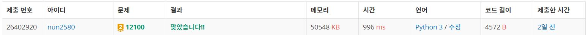

# 2048 (Easy)

> 생각치 못한 예외를 못잡아내서 결국 다른 사람 풀이를 봤다. 근데 그 풀이법이 더 좋은거 같아 해당 로직으로 구현했다.

## 풀이방법

문제를 보자마자 구현문제라고 생각했다.

Queue 자료구조를 이용하였고 집어넣을 원소로는 (board, move)를 넣어주었다. Queue 자료구조에서 원소를 하나 꺼낸 뒤, 해당 board에서 가장 큰 값을 알아내어 result에 저장한다. 그 후, board를 상,하,좌,우로 움직인 뒤 움직이기 전과 모양이 다르다면 Queue에 넣어준다.

위 과정이 끝나면 result의 값을 출력하면 된다.

문제를 풀면서 상하좌우로 움직이는 로직을 만드는 것이 상당히 힘들었고, 움직이는 로직을 구현할 때도 마찬가지로 Queue 자료구조를 이용하였다.

예를들어, 아래와 같이 한 줄짜리 board를 왼쪽으로 움직인다고 가정해보자.
> 0 0 8 0 8 16

그러면 원하는 결과 값은
> 16 16 0 0 0

이 나와야 한다.

이를 구현하기 위해서, 왼쪽부터 하나씩 숫자를 읽으면서 0이 아닌 숫자를 만날때 해당 숫자를 큐에 집어 넣어준다. 그러면 큐에는 
>8 8 16

이 들어와있다.

그 후 큐를 다시 한번 더 검사하여 같은숫자가 두개 붙어있다면 합쳐준 뒤, 나머지 공간은 0으로 채워준다
> 16 16 0 0 0 0

그리고는 모양에 맞추어 board에 해당 값들을 넣어주면 된다.

## 인증
