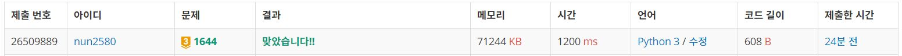

# 소수의 연속합

## 풀이방법

1. 소수의 연속합을 구하기 위해서는 소수가 저장된 리스트가 필요하고 생각했다. 그리하여 아래와 같이 `에라토스테네스의 체` 알고리즘을 사용하여 소수 리스트를 구했다.
    ```python
    def prime_list(n):
        sieve = [True] * n

        m = int(n**0.5)
        for i in range(2,m+1):
            if sieve[i] == True:
                for j in range(i+i,n,i):
                    sieve[j] = False
        return [i for i in range(2,n) if sieve[i] == True]
        
    prime = prime_list(N+1)
    ```

2. 구해진 소수 리스트인 `prime`을 바탕으로 `투포인터` 알고리즘을 사용하여 연속합을 구하고자 생각했다.
    - start index와 end index를 만들어서 처음부터 prime 리스트를 검사한다.
    - 이때, sum(prime[start:end+1])의 값이 주어진 입력인 n 보다 작을 경우 sum(prime[start:end+1]) 값을 늘려야 하므로 end += 1
    - sum(prime[start:end+1])의 값이 주어진 입력인 n 보다 클 경우 sum(prime[start:end+1]) 값을 줄여야 하므로 start += 1
    - sum(prime[start:end+1])과 n이 같을 경우 start:end+1 이상의 범위에서는 더이상 답이 없으므로 start += 1 하고 result += 1을 해준다.
  - 위 과정이 끝난 뒤 result를 출력하면 된다.

## 아쉬운 점
다른 사람들이 통과한 시간을 보면 빠르면 340ms 정도로 문제를 해결한 사람도 있다. 더 효율적으로 코드를 개선할 필요가 있어보인다.

## 인증
