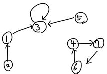
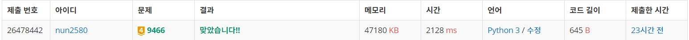

# 텀 프로젝트

## 풀이방법

>주어진 선택의 결과를 보고 어느 프로젝트 팀에도 속하지 않는 학생들의 수를 계산하는 프로그램을 작성하라.

라는 문제의 글을 보고, 일단 아래와 같이 그래프를 그려보았다. 이때, node : 학생, edge : 프로젝트를 함께 하고 싶은 학생 

위와같이 생성된 그래프를 바탕으로 위상정렬을 수행한다.

초반 indegree가 0인 node들은 당연히 Cycle이 아니다.

또한, 위 node들과 연결이 되어있으면서 그 순간 indegree가 0이 되면 이 또한 Cycle이 아니다.

위 과정이 끝나면, Cycle이 아닌 node들을 찾을 수 있고, 이 node들의 갯수를 출력하면 된다.

## 인증
