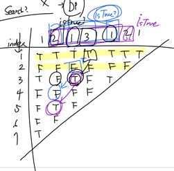

- 풀이 방법
  - 팰린드롬이란 '121', '1223221'과 같이 뒤집어도 똑같은 숫자를 의미한다.
  - N<=2,000, M<=1,000,000 인데 이를 1초안에 해결해야하므로 처음 든 생각은 O(NM)은 불가능하고, 그러면 O(MlogN)으로 해결해야한다는 생각이 들었다.
  - 그래서 logN을 보고 이분 탐색을 떠올렸으나 이분 탐색으로는 어떻게 해야할지 감을 못잡고 그다음 DP를 떠올렸다.
  - DP[i][j]
    - j번째 숫자부터 i개의 숫자가 펠린드롬 숫자인지에 대한 True False를 저장한다.
  - 
    - 처음 dp 테이블을 생각하면서 그린 모습.
    - 예제의 dp를 생성하면 아래와 같이 생성이 된다.
  - DP를 전부 False로 초기화 한 뒤 row 1과 row 2를 먼저 구한다.
  -  row 3부터는 아래의 조건이 맞을경우 True로 바꿔준다.     
    ```python
    if data[j] == data[j+i-1] and dp[i-2][j+1] == 1:  #isTrue?
      dp[i][j] = 1
    ```  

    - data[j] == data[j+i-1] 
      - 제일 앞과 제일 뒤의 숫자가 똑같으며
    - dp[i-2][j+1] == 1
      - 제일 앞 숫자와 제일 뒤 숫자를 제외한 숫자들이 팰린드롬 숫자라면

  - 구해진 DP 테이블을 바탕으로 출력을 하면 된다.
    - print(dp[E-S+1][S])
      - [E-S+1] => 검사할 숫자들의 개수
      - [S] => 몇번째 수부터 시작인가