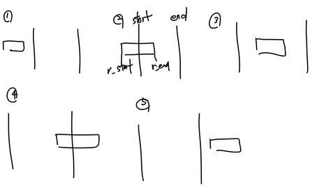

# 추석 트래픽

## 풀이 방법

이 문제의 경우 주어진 input을 내가 다루기 쉽도록 변경을 해줘야한다.

예를들면 아래와 같이 입력이 들어왔다고 생각해보자.
```
[
"2016-09-15 01:00:04.001 2.0s",
"2016-09-15 01:00:07.000 2s"
]
```

그러면 "2016-09-15 01:00:04.001 2.0s" 에서 년도-월-일을 나타내는 `2016-09-15` 없애버리고, `01:00:04.001`이 시각을 second로 바꿔 표현한다. 그러면 01*3600 + 00*60 + 04.001 = 3604.001이 된다. 이 시각은 끝나는 시각(end_time)이 되고, 시작한 시각(start)도 따로 구하였다. 시작한 시각은 strat_time = round(end_time - float(c[:-1]) + 0.001,3) 으로 구했으며, end_time에서 걸리 시간을 빼고 그 후 0.001초를 더해줘야된다.(0~0.999초가 1초동안 진행한 시간이기 때문에)

이렇게 입력값들을 전처리 후, 다음에는 1초내 처리량의 max 값을 구해야하는데, 1ms씩 나눠서 검사하기에는 양이 너무 많다. 그러므로, 생각한 방법이 1초내의 처리량이 변경이 될려면 어떤 부분의 시작점이나 끝점에서 변경이 일어나므로 이러한 부분들만 검사하면된다고 생각했다. 그럴경우 아래의 5가지 경우들이 있다는 사실을 알 수 있다.



이 중 1번과 5번 case를 제외한 경우 전부 해당 시간안에 들어가므로 result+=1을 해주면 된다.

```python
for r in rem:
    r_start, r_end = r
    if r_end < start or r_start > end:
        continue
    result+=1
```